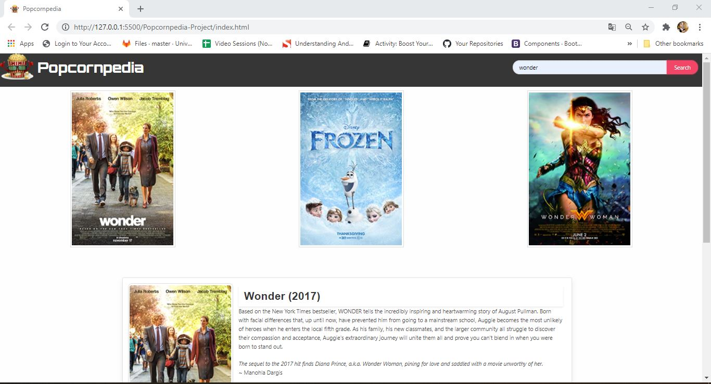
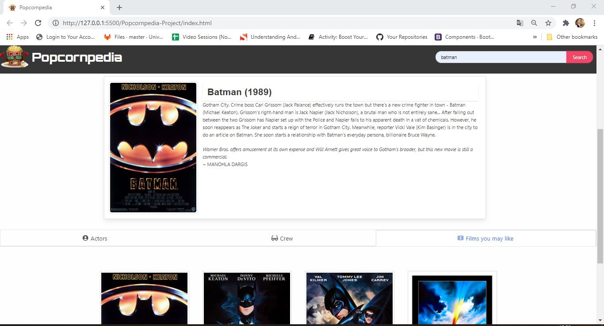
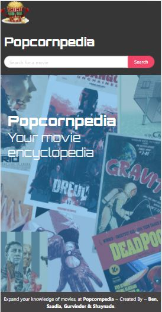
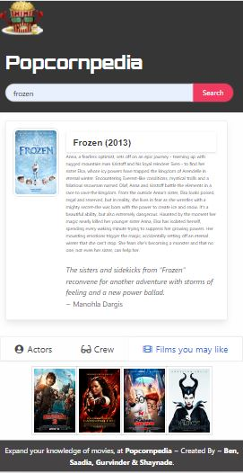

# Popcornpedia-Project
-----------------------------------------------------------------------------------------------------------------------
Table of content :

1. The purpose
2. The method
3. HTML file
4. Foundation frameworks
5. Bulma framework
6. JQuery file
7. API databases
8. Demonstration
9. URLs 

-----------------------------------------------------------------------------------------------------------------------

## 1. The purpose :

The main purpose of this project is to create an application that allows a user to search a film, view info about the film including actor and crew information, and receive recommendations based on their search. 
This app will run in the browser and feature dynamically updated HTML and CSS powered by JavaScript. The project will also use the Foundation and Bulma CSS Framework and make use of the different APIs. 

-----------------------------------------------------------------------------------------------------------------------

## 2. The method : 

    This website is created using the following languages, libraries and softwares.

    * HTML files : index.html.
    * JQuery file: script.js
    * Foundation framework
    * Bulma framework
    * Third party APIs
    * JSON
    * Ajax
    * VS Code
    * Github
   
-----------------------------------------------------------------------------------------------------------------------

## 3. HTML file : 
    
    This file is created according to the standards.

    * Using sementics
    * Using consistently indentation and spacing
    * Using links to link the HTML file to other files (script and style files)
    * Using external links to link the HTML file to Foundation and JQuery
    * Commenting the code

-----------------------------------------------------------------------------------------------------------------------

## 4. Foundation Framework :  

This open-source framework is used to style and make dynamic modals and tootips the website.

    The main Foundation components used in this website are :

    * Modals : .small, .reveal, .data-reveal, .open-data, .reveal-overlay
    * Moadals button : .close-button
    * Tooltip : .data-tooltip
    * Foundation initialiser : $(document).foundation();
    * Thumbnail : .thumbnail

-----------------------------------------------------------------------------------------------------------------------

## 5. Bulma Framework :

This open-source framework is used to style the website and make it reponsive. 

    The main Bulma components used in this website are :

    * Grid-system : container, rows and columns (.container, .columns, .column)
    * Responsive grid: .is-mobile
    * Margin and padding : .m, .p
    * Navigation bar : .navbar, .fixed-top, navbar-start, .navbar-end, navbar-item, is-dark
    * tabs : .tabs, .tab, .is-boxeb, is-medium
    * Card : .card, .card-header, .card-header-title, .card-image, .card-content
    * Button : .button, is-rounded, is-focused, is-danger
    * Input : .input, .is-rounded
    * Image : .image, is-96x96
    * Banner : .hero, .is-fullheight, .is-info

-----------------------------------------------------------------------------------------------------------------------

## 6. JQuery file : 

This file is used to create a dynamic website using functions to create a simple calendar.

    The main JQuery properties and methods used in this website are :
    
    * Functions  
    * HTML DOM : .ready() Method, .on() Method, localStorage.setItem() Method,localStorage.getItem() Method, .text() Method, .val() Method, .attr() Method, .append() Method,
    .css() Method, .addClass() Method, .empty() Method
    * Conditions : if statements
    * JSON Methods : .stringify() Method, .parse() Method    

-----------------------------------------------------------------------------------------------------------------------

## 7. API databases : 

The API interface used for this project is the OpenWeather API : 

* OMDb API : "https://www.omdbapi.com/"
* IMDb API : "https://rapidapi.com/apidojo/api/imdb8"
* CelebrityNinjas API : "https://rapidapi.com/celebrityninjas/api/celebrityninjas" 
* TasteDive API : "https://tastedive.com/read/api" 
* NYT API : "https://developer.nytimes.com/docs/movie-reviews-api/1/overview"

-----------------------------------------------------------------------------------------------------------------------
## 8. Demonstration :  

Desktop version :

Mobile version :

-----------------------------------------------------------------------------------------------------------------------

## 9. URLs 

* The URL of the deployed application : https://ben-pauley.github.io/Popcornpedia-Project/

* The URL of the GitHub repository: https://github.com/ben-pauley/Popcornpedia-Project.git

-----------------------------------------------------------------------------------------------------------------------
